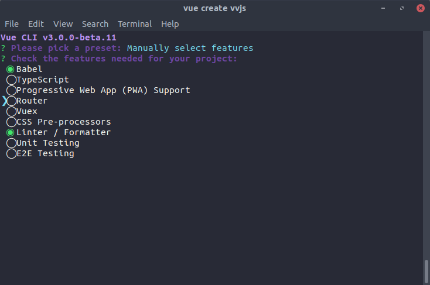
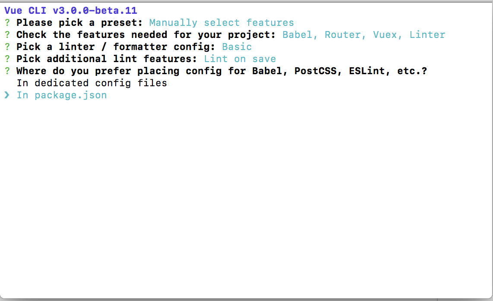
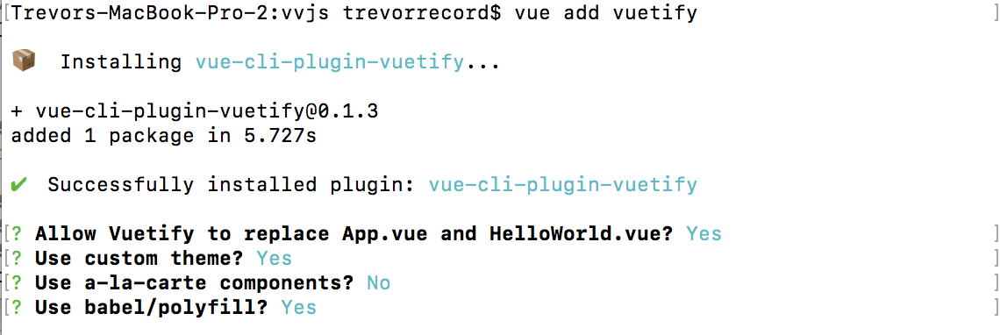
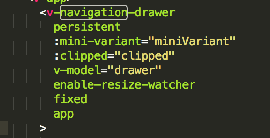
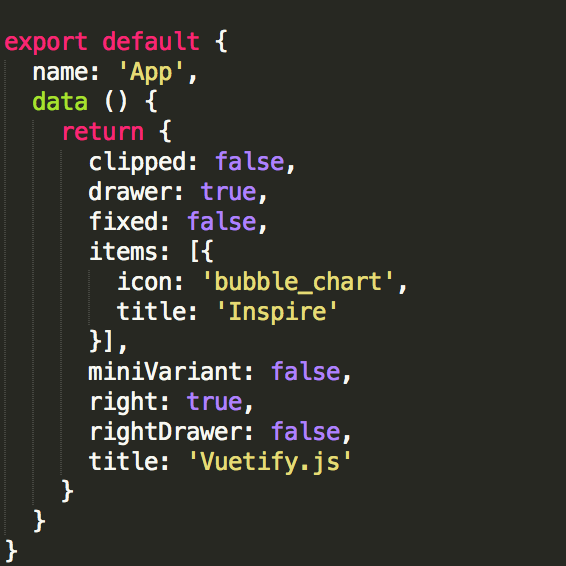
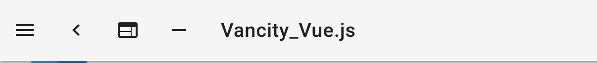
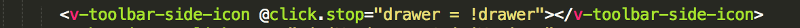

# vue-workshop-demo

> This project is meant to be the end state of a walkthrough of how to get build an beginner web application with Vue JS that connects to an API. It makes use of Vue-cli 3 and vuetify.

## Initial Setup
### Install Vue CLI

To start off with, we'll open our terminal. You'll want to have NPM or Yarn installed. Then you'll want to install vue-cli:

``` bash
# Install .
npm install -g @vue/cli
# or
yarn global add @vue/cli
```

Once that is done you should have the newest version of Vue-cli. Check that you do by running the following:

``` bash
vue -V
```

This should return should be 3.0.0-beta.x. If it does, we're ready to start getting set up. 

### Install the project
Enter the following in your terminal: 

``` bash
vue create vvjs
```

You'll be given a set of options. You will want to "manually" select features. Make sure to add Vuex and Router. Here's the setup that we will use for our installation:

1) Manually select features
2) Vuex and Router should be selected. Press space to select them.

3) Config should be in package.json

4) "n" do not save
5) Use NPM



Once the initial installation is completed, you'll have a working project! You can already see something if you run the following:

``` bash
cd vvjs
npm run serve
```

Now go to in your browser. You can press control + C in your terminal to stop the process running the development instance of your site.

### Install Vuetify/Babel/Axios

Before we go any further, we're going to install a couple of dependencies to allow us to bootstrap our project a little further. The first of these is Vuetify, which will give us an interface for our project. You won't have to use Vuetify on all of your projects! But it will give us a navigation bar and some basic styling when we first load up our application. Enter the following to see your starting place:

``` bash
cd vvjs
vue add vuetify
```
1) "y" allow Vuetify to replace app.vue and helloworld.vue
2) "y" use custom theme
3) "n" use a la carte components
4) "y" use babel/polyfilly


There are two dependencies that we'll be adding to the project: Babel (which will allow us to use ES2015+ without worrying about browser support), and Axios (which we will use to connect to an API later). Install them with the following commands.

``` bash
npm install --save @babel/polyfill
npm install --save axios vue-axios
```

Then open src/main.js and add the following:

``` main.js
import router from './router' // Add everything after .router:
import axios from 'axios'
import VueAxios from 'vue-axios'

Vue.use(VueAxios, axios)
```
We'll be moving on to actually getting started on building something now!

## Getting started

Vue has a wide variety of core and add-on features, so let's start with some of the basics.

### Reading a Vue file

Right now, when we launch our app, the navigation bar defaults to being open. That's annoying! We'll want to change that.

If you open up the folder "src" in your vvjs folder you'll see an "App.vue" file, a file which serves as the root component of this application. A .vue files i broken into three sections: the template, the scripts, and the styles. App.vue only has the templates and the scripts right now, but if we want to horizontally center the content in our application we can add the following at the bottom of the file:

```html
<style>
main.content {
	display:block;
	margin: 20px auto;
	max-width: 100%;
	width: 1024px;
}
</style>
``` 

If you look at the template section for App.vue (at the top), you'll see that there's a component called "v-navigation-drawer" that has something called a "v-model" which is set to "drawer." If you scroll down a little to the "scripts" section, you will see that there is a set of "data" which includes "drawer"... and it is set to "true". The values in the data here are what is controlling whether the nav bar should be displayed or not!




Let's change that set of data. Set "drawer" to false. While we're at it, let's also change the "title" to 'Vancity_Vue.js'. This is what our data now looks like:
```javascript
export default {
  name: 'App',
  data () {
    return {
      clipped: false,
      drawer: false,
      fixed: false,
      items: [{
        icon: 'bubble_chart',
        title: 'Vancity Vue JS'
      }],
      miniVariant: false,
      right: true,
      rightDrawer: false,
      title: 'Vancity_Vue.js'
    }
  }
}
```
If you reload your page, that annoying nav won't be open by default, and we'll have our new title. How did the title change? If you scroll back up to the template, you'll see a "v-toolbar-title" element that has a v-text attribute set to "title." 


Data in Vue can be used to store booleans, integers, strings, arrays, and objects. It's the basic building block of working with Vue, so why don't we dive a little deeper into it. 

### Data Binding and Methods

#### Data binding

Let's open up the file src/views/About.vue. You'll see there's an element titled "HelloWorld." Let's get rid of that for now, and replace it with the following template:

```html
<template>
  <div class="home">
    
    <h1 v-text="msg"></h1>
    <input type="text" name="message" v-model="msg"/>
  </div>
</template>
```

Down in the scripts section let's add the following new data to it:

```javascript
  data () {
    return {
      msg: "Testing v-model"
    }
  },
```
Save and open up your browser to your local host. You'll see the message "Testing v-model" with an input below it. Try changing the text in the input. The header above the input updates as you type!

You can use "v-text" to insert data in an element, or you can place {{ data-name }} inside the element -- either will work. You can also use the "v-model" attribute to bind data to an element that will also update the data, like a text element (this is called two-way data binding).

#### Repeating data sets

Now let's take a look at how to repeat data in Vue. Let's start by updating the data so that it HAS an array of data. I don't know why you guys got into promgramming, but I did it to keep track of my Pokemon. Let's update the data so it has the following:

```javascript
data () {
    return {
      msg: "Testing v-model",
      monsters: [
        {
          name:"Cougher", 
          species:"Koffing",
          avatar:"https://cdn.bulbagarden.net/upload/1/17/109Koffing.png",
          type: "Gas/Poison"
        },
        {
          name:"Zapper", 
          species:"Jolteon", 
          avatar:"https://cdn.bulbagarden.net/upload/b/bb/135Jolteon.png",
          type: "Electric"
        },
        {
          name:"Scratcher", 
          species:"Mankey", 
          avatar:"https://cdn.bulbagarden.net/upload/4/41/056Mankey.png",
          type: "Fighting"
        }
      ]
    }
},
```

Then let's add the following to the template, below our input:
```html
<h2>My Pokémon:</h2>
<v-list two-line>
  <v-list-tile v-for="(monster, index) in monsters" :key="index">
    <v-list-tile-avatar>
      
    </v-list-tile-avatar>
    <v-list-tile-content>
      <v-list-tile-title><strong>Name:</strong> {{ monster.name }}</v-list-tile-title>
      <v-list-tile-sub-title><strong>Species:</strong> {{ monster.species }} <strong>Type:</strong> {{ monster.type }}</v-list-tile-sub-title>
    </v-list-tile-content>
  </v-list-tile>
</v-list>
```

Notice that the element "v-list-tile" has the following attribute: v-for="monster in monsters". Following that, it binds the image by putting the "avatar" key of the monster to the :src attribute. You can bind information from data to a regular html attribute by putting a colon : before it, like that. We also have the pokémon's name, species, and type getting inserted into this repeating tile by inserting it in double curly brackets.

#### Methods (& Conditionals)

If you looked closely at App.vue, you'd have seen there is also a button with the element name "v-toolbar-side-icon" that has an attribute called "@click.stop" that was setting the "drawer" to != "drawer".


This is what was toggling the display of the nav item. But what if we want to have a method that is more than one line long? Let's try adding an input and button that allows us to add new monsters to our roster that we can name. Let's start by adding a field in our data to hold our monster's name: 

```javascript
data () {
    return {
      msg: "Testing v-model",
      newName: "",
```

Now let's also add a little form to add the charmander. Under our pokémon list let's add the following:

```html
<div>
  <h3>Add a Charmander:</h3>
  <form>
    <v-text-field
      v-model="newName"
      label="New Charmander Name"
    ></v-text-field>
      <v-btn v-if="newName" @click.stop="addPokemon()">Add Pokémon</v-btn>
  </form>
</div>
```

This will give us a little form with an input that allows us to specify a name, and a button that will call a method called "addPokemon." You might also notice that there is an attribute on the button titled 'v-if="newName".' This will check to make sure that you've specified a name for your Charmander before you add it to your list. It would be a crime not to give your Pokémon a name. We'll also need to add the method to handle adding

```javascript
  methods: {
    addPokemon: function () {
      let newPokemon = {
          name: this.newName, 
          species: "Charmander", 
          avatar: "https://cdn.bulbagarden.net/upload/thumb/7/73/004Charmander.png/500px-004Charmander.png",
          type: "Fire"
        };
      this.monsters.push(newPokemon);
      this.newName = "";
    }
  },
```

Now that list is getting a little long! I only like to have 3 pokemon in my collection at any time, so let's add a method to remove pokemon as well. Above addPokemon, let's add a new function that looks like this:

```javascript
removePokemon: function (index) {
  this.monsters.splice(index, 1);
},
```

Now let's add a button to remove the pokemon. Just before the closing "</v-list-tile>" tag, add the following:

```html
<v-btn @click.stop="removePokemon(index)">Remove Pokémon</v-btn>
```
Clicking on this button will now allow you to quickly remove those pesky extra pokémon!

We now have a form with a method that allows us to modify the data on this page, including user-specified inputs! Now, let's move on to the next phase: changing views and loading in external data.


## Stepping things up
### Routing

We're done with Home.vue for the moment, so let's return to src/App.vue. Inside the element <v-navigation-drawer> put the following:

```html
<v-list-tile>
  <router-link to="/">Home</router-link>
</v-list-tile>
<v-list-tile>
  <router-link to="/about">About</router-link>
</v-list-tile>
<v-list-tile>
  <router-link to="/list">List</router-link>
</v-list-tile>
```

Now we have three nav items in our navigation bar! If you click on the "home" and "about" links the router will take you to our home page, and an about page. The third link won't work yet. We'll need to create a new view, and then add it to the router. Let's start by saving a new file to src/views/List.vue with the following markup:

```html
<template>
  <div class="master-list">
    <h1>Master List</h1>
  </div>
</template>

<script>

export default {
  name: 'list',
  data () {
    return {
      monsters: []
    }
  },
  methods: {
    getPokemon: function () {
    }
  }
};
</script>
```

Now let's open up src/router.js and add a route for this new page. Add the following to the bottom of the list of imports:

```javascript
import List from './views/List.vue'
```

Then in the array of lists, under the one for the about page, add the following:

```javascript
	{
      path: '/about',
      name: 'about',
      component: About
    },
	{
      path: '/list',
      name: 'list',
      component: List
    }
  ]
```


### Axios & connectivity

### Components

### Computed Properties

### Watchers

