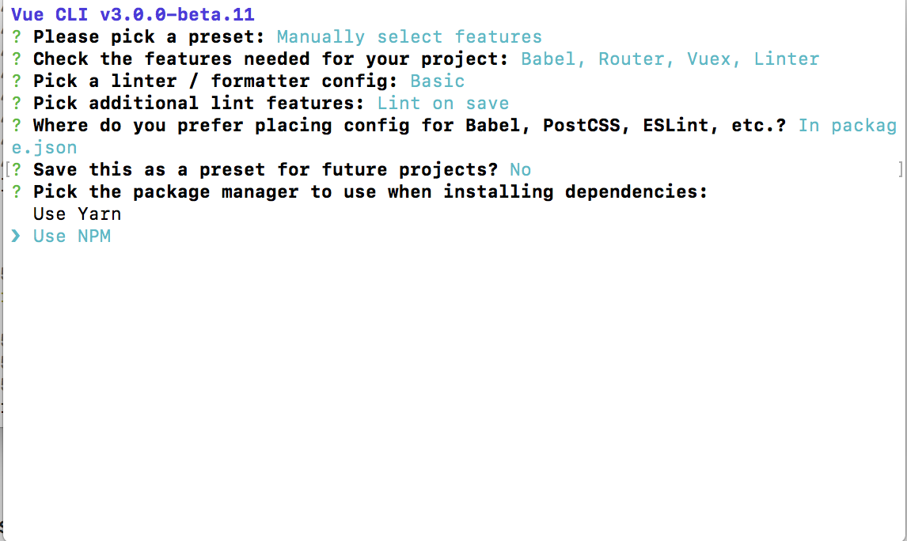
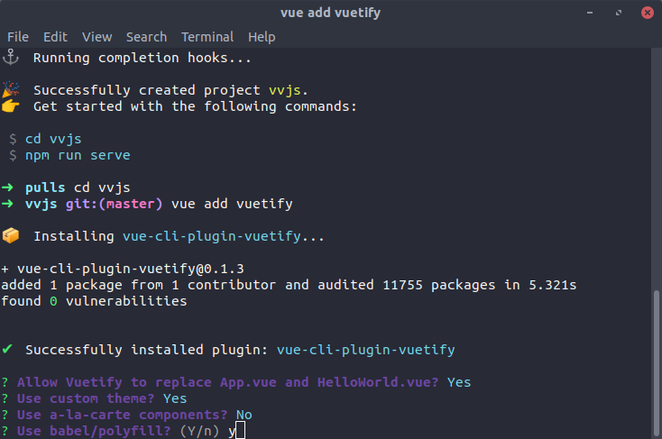

# vue-workshop-demo

> This project is meant to be the end state of a walkthrough of how to get build an beginner web application with Vue JS that connects to an API. It makes use of Vue-cli 3 and vuetify.

## Initial Setup
### Install Vue CLI

To start off with, we'll open our terminal. You'll want to have NPM or Yarn installed. Then you'll want to install vue-cli:

``` bash
# Install
npm install -g @vue/cli@3.0.0-beta.11
# or
yarn global add @vue/cli@3.0.0-beta.11
```

Once that is done you should have the newest version of Vue-cli. Check that you do by running the following:

``` bash
vue -V
```

This should return should be 3.0.0-beta.x. If it does, we're ready to start getting set up.

### Install the project
Enter the following in your terminal:

``` bash
vue create vvjs
```

You will be given a set of options. You will want to "manually" select features. Make sure to add Babel and Router. Optionally you could select the Linter / Formatter which just keeps your code looking clean. Here's the setup that we will use for our installation:

1) Manually select features
2) Babel and Router should be selected, press space bar to select them.

4) Config should be in package.json

5) "n" do not save
6) Use NPM


Once the initial installation is completed, you'll have a working project! You can already see something if you run the following:

``` bash
cd vvjs
npm run serve
```

Now go to in your browser. You can press control + C in your terminal to stop the process running the development instance of your site.

### Install Dependencies: Vuetify/Axios

Before we go any further, we're going to install a couple of dependencies to allow us to bootstrap our project a little further. The first of these is Vuetify, which will give us an interface for our project. You won't have to use Vuetify on all of your projects, but it will give us a navigation bar and some basic styling when we first load up our application. Enter the following in your project folder to add vuetify:

``` bash
vue add vuetify
```
1) "y" allow Vuetify to replace app.vue and helloworld.vue
2) "y" use custom theme
3) "n" use a la carte components
4) "y" use babel/polyfilly


We will now install axios - an HTTP client for making API calls:

``` bash
npm install --save axios
```

Now we will be moving on to actually getting started on building something!

## Getting started

Vue has a wide variety of core and add-on features, so let's start with some of the basics.

### Reading a Vue file

Right now, when we launch our app, the navigation bar defaults to being open. That's annoying! We'll want to change that.

If you open up the folder "src" in your vvjs folder you'll see an "App.vue" file, a file which serves as the root component of this application. A .vue files i broken into three sections: the template, the scripts, and the styles. App.vue only has the templates and the scripts right now, but if we want to horizontally center the content in our application we can add the following at the bottom of the file:

```html
<style>
main.content {
	display:block;
	margin: 20px auto;
	max-width: 100%;
	width: 1024px;
}
</style>
```

If you look at the template section for App.vue (at the top), you'll see that there's a component called "v-navigation-drawer" that has something called a "v-model" which is set to "drawer." If you scroll down a little to the "scripts" section, you will see that there is a set of "data" which includes "drawer"... and it is set to "true". The values in the data here are what is controlling whether the nav bar should be displayed or not!
```html
<v-navigation-drawer
  persistent
  :mini-variant="miniVariant"
  :clipped="clipped"
  v-model="drawer"
  enable-resize-watcher
  fixed
  app
>
```
```javascript
export default {
  name: 'App',
  data () {
    return {
      clipped: false,
      drawer: true, // Is set to true
      fixed: false,
      items: [{
        icon: 'bubble_chart',
        title: 'Vancity Vue JS'
      }],
      miniVariant: false,
      right: true,
      rightDrawer: false,
      title: 'Vancity Vue.js'
    }
  }
}
```

Let's change that set of data. Set "drawer" to false. While we're at it, let's also change the "title" to 'Vancity_Vue.js'. This is what our data now looks like:
```javascript
export default {
  name: 'App',
  data () {
    return {
      clipped: false,
      drawer: false, // Set it to false
      fixed: false,
      items: [{
        icon: 'bubble_chart',
        title: 'Vancity Vue JS'
      }],
      miniVariant: false,
      right: true,
      rightDrawer: false,
      title: 'Vancity Vue.js'
    }
  }
}
```
If you reload your page, that annoying nav won't be open by default, and we'll have our new title. How did the title change? If you scroll back up to the template, you'll see a "v-toolbar-title" element that has a v-text attribute set to "title."


Data in Vue can be used to store booleans, integers, strings, arrays, and objects. It's the basic building block of working with Vue, so why don't we dive a little deeper into it.

### Data Binding and Methods

#### Data binding

Let's open up the file src/views/About.vue. You'll see there's an element titled "about." Let's get rid of that for now, and replace it with the following template:

```html
<template>
  <div class="home">
    
    <h1 v-text="msg"></h1>
    <input type="text" name="message" v-model="msg"/>
  </div>
</template>
```

Down in the scripts section let's add the following new data to it:

```javascript
  data () {
    return {
      msg: "Testing v-model"
    }
  },
```
Save and open up your browser to your local host. You'll see the message "Testing v-model" with an input below it. Try changing the text in the input. The header above the input updates as you type!

You can use "v-text" to insert data in an element, or you can place {{ data-name }} inside the element -- either will work. You can also use the "v-model" attribute to bind data to an element that will also update the data, like a text element (this is called two-way data binding).

#### Repeating data sets

Now let's take a look at how to repeat data in Vue. Let's start by updating the data so that it HAS an array of data. I don't know why you guys got into promgramming, but I did it to keep track of my Pokemon. Let's update the data so it has the following:

```javascript
data () {
    return {
      msg: "Testing v-model",
      monsters: [
        {
          name:"Cougher",
          species:"Koffing",
          avatar:"https://cdn.bulbagarden.net/upload/1/17/109Koffing.png",
          type: "Gas/Poison"
        },
        {
          name:"Zapper",
          species:"Jolteon",
          avatar:"https://cdn.bulbagarden.net/upload/b/bb/135Jolteon.png",
          type: "Electric"
        },
        {
          name:"Scratcher",
          species:"Mankey",
          avatar:"https://cdn.bulbagarden.net/upload/4/41/056Mankey.png",
          type: "Fighting"
        }
      ]
    }
},
```

Then let's add the following to the template, below our input:
```html
<h2>My Pokémon:</h2>
<v-list two-line>
  <v-list-tile v-for="(monster, index) in monsters" :key="index">
    <v-list-tile-avatar>
      
    </v-list-tile-avatar>
    <v-list-tile-content>
      <v-list-tile-title><strong>Name:</strong> {{ monster.name }}</v-list-tile-title>
      <v-list-tile-sub-title><strong>Species:</strong> {{ monster.species }} <strong>Type:</strong> {{ monster.type }}</v-list-tile-sub-title>
    </v-list-tile-content>
  </v-list-tile>
</v-list>
```

Notice that the element "v-list-tile" has the following attribute: v-for="monster in monsters". Following that, it binds the image by putting the "avatar" key of the monster to the :src attribute. You can bind information from data to a regular html attribute by putting a colon : before it, like that. We also have the pokémon's name, species, and type getting inserted into this repeating tile by inserting it in double curly brackets.

#### Methods (& Conditionals)

If you looked closely at App.vue, you'd have seen there is also a button with the element name "v-toolbar-side-icon" that has an attribute called "@click.stop" that was setting the "drawer" to != "drawer".


This is what was toggling the display of the nav item. But what if we want to have a method that is more than one line long? Let's try adding an input and button that allows us to add new monsters to our roster that we can name. Let's start by adding a field in our data to hold our monster's name:

```javascript
data () {
    return {
      msg: "Testing v-model",
      newName: "",
```

Now let's also add a little form to add the charmander. Under our pokémon list let's add the following:

```html
<div>
  <h3>Add a Charmander:</h3>
  <form>
    <v-text-field
      v-model="newName"
      label="New Charmander Name"
    ></v-text-field>
      <v-btn v-if="newName" @click.stop="addPokemon()">Add Pokémon</v-btn>
  </form>
</div>
```

This will give us a little form with an input that allows us to specify a name, and a button that will call a method called "addPokemon." You might also notice that there is an attribute on the button titled 'v-if="newName".' This will check to make sure that you've specified a name for your Charmander before you add it to your list. It would be a crime not to give your Pokémon a name. We'll also need to add the method to handle adding

```javascript
  methods: {
    addPokemon: function () {
      let newPokemon = {
          name: this.newName,
          species: "Charmander",
          avatar: "https://cdn.bulbagarden.net/upload/thumb/7/73/004Charmander.png/500px-004Charmander.png",
          type: "Fire"
        };
      this.monsters.push(newPokemon);
      this.newName = "";
    }
  },
```

Now that list is getting a little long! I only like to have 3 pokemon in my collection at any time, so let's add a method to remove pokemon as well. Above addPokemon, let's add a new function that looks like this:

```javascript
removePokemon: function (index) {
  this.monsters.splice(index, 1);
},
```

Now let's add a button to remove the pokemon. Just before the closing "</v-list-tile>" tag, add the following:

```html
<v-btn @click.stop="removePokemon(index)">Remove Pokémon</v-btn>
```
Clicking on this button will now allow you to quickly remove those pesky extra pokémon!

We now have a form with a method that allows us to modify the data on this page, including user-specified inputs! Now, let's move on to the next phase: changing views and loading in external data.


## Stepping things up

### Theming
First lets set our vuetify theme. Open the vuetify.js file in the plugins folder and change the theme values to these(or whichever you choose):
```javascript
primary: '#FFDE00',
secondary: '#3B4CCA',
accent: '#CC0000',
error: '#FF0000',
info: '#FFOE00',
success: '#4CAF50',
warning: '#FFC107'

```

### Routing
Alright we're done with learning the basics, now lets create a real application! replace your App.vue with the following.
```html
<template>
  <v-app>
    <v-navigation-drawer
      class="secondary pa-3"
      persistent
      v-model="drawer"
      enable-resize-watcher
      fixed
      dark
      app
    >
      <h2 class="white--text">Your Menu</h2>
      <v-list>
        <v-list-tile to="/">
          <v-icon class="mr-2" small>home</v-icon>
          Home
        </v-list-tile>
        <v-list-tile to="/about">
          <v-icon class="mr-2" small>info</v-icon>
          About
        </v-list-tile>
        <v-list-tile to="/list">
          <v-icon class="mr-2" small>list</v-icon>
          List
        </v-list-tile>
      </v-list>
    </v-navigation-drawer>
    <v-toolbar
      class="primary"
      dark
      app
    >
      <v-toolbar-side-icon @click.stop="drawer = !drawer"></v-toolbar-side-icon>
      <v-toolbar-title v-text="title"></v-toolbar-title>
    </v-toolbar>
    <v-content>
      <!-- Your pages will route here -->
      <router-view/>
    </v-content>
  </v-app>
</template>

<script>
export default {
  name: 'App',
  data() {
    return {
      drawer: true,
      title: 'Pokemon'
    }
  }
}
</script>

<style>
.list .list__tile {
  border-radius: 5px;
}
.list .list__tile--active {
  background-color: #2e3ca5;
}
</style>

```

Now we have three nav items in our navigation bar! If you click on the "home" and "about" links the router will take you to our home page, and an about page. The third link won't work yet. We'll need to create a new view, and then add it to the router. Let's start by saving a new file to src/views/List.vue with the following markup.
```html
<template>
  <div class="pa-4">
    <v-card class="pa-4">
      <h2 class="secondary--text uppercase">Character List</h2>
    </v-card>
  </div>
</template>

<script>
export default {
  name: 'list',
  data() {
    return {
      pokemons: []
    }
  },
  methods: {
    async getPokemons() {}
  }
}
</script>
```

Now let's open up src/router.js and add a route for this new page. Add the following to the top of the page after the imports.
```javascript
import List from './views/List.vue'
```

Then in the array of routes, under the one for the about page, add the following.
```javascript
{
    path: '/list',
    name: 'list',
    component: List
  }
]
```

### Axios & connectivity
Now adding pokemon manually is okay, but lets try hitting up an actual API for the data. We are going to access the Poke API and see what we can add to our app.
Import axios just inside the script tag.
```javascript
import axios from 'axios'
```

Then add the following code to your getPokemon method.
```javascript
const resp = await axios.get('https://pokeapi.co/api/v2/pokemon')
return resp.data
```

Now we can hook into the mounted vue lifecycle hook to make this call as soon as our element is ready


we will be dealing with mounted to keep it simple as the element is ready and we can make any dom chances if neccessary.
Add the following after the data() method.
```javascript
async mounted() {
  this.pokemons = await this.getPokemons()
  console.log(this.pokemons)
}
```

Now refresh the page and open developer tools (f12) or right click the page and inspect element then press console.
You will see an object with a few options.
```javascript
{
  count: 949, // the total number of pokemon in the database,
  next: "https://pokeapi.co/api/v2/pokemon/?limit=20&offset=20", // the api endpoint for the next page of results
  previous: null, // the url for the previous page of results
  results: Array(20) // the first 20 pokemon from the list
}
```

Since we want the results we can add that to our getPokemon method return value.
```javascript
const resp = await this.$http.get('https://pokeapi.co/api/v2/pokemon')
return resp.data.results
```
### Components & Props

Now that we have a list of pokemon in our console, lets display them on our list page.
First lets create a new component. In the components folder, create a new Pokemon.vue file and fill it with the following.
```html
<template>
  <v-flex xs12 md6>
    <v-list-tile avatar>
      <v-list-tile-avatar>
        
      </v-list-tile-avatar>
      <v-list-tile-content>
        <v-list-tile-title class="capitalize title">Bulbasaur</v-list-tile-title>
      </v-list-tile-content>
    </v-list-tile>
  </v-flex>
</template>

<script>
export default {
  name: 'pokemon'
}
</script>
```

Now we can go back and access it from our list by first importing it after axios. @ is an alias for the src folder.
```javascript
import pokemon from '@/components/Pokemon.vue'
```

Then you must register it to be used as a local component by adding a new components property to your list object.
```javascript
components: {
  pokemon
}
```

Now we can access the new pokemon component in the template like so.
```html
<h2 class="secondary--text uppercase">Character List</h2>
<v-container grid-list-md text-xs-center>
  <v-layout row wrap>
    <pokemon v-for="pokemon in pokemons" :key="pokemon.name"></pokemon>
  </v-layout>
</v-container>
```

We have a nice list of Bulbasaurs! But that's not exactly what we were going for. Let's pass the individual pokemon names into the component using props.
Props can be used just like a regular bindings. Lets pass in the index as well, which we will use for a little hack later. We can also remove the console.log here.
```html
<pokemon :name="monster.name" :number="index" v-for="(pokemon, index) in pokemons" :key="pokemon.name"></pokemon>
```

Let's go back into our pokemon component now and access the props using the props property.
```javascript
props: ['name', 'number']

```
```html
<v-list-tile-title class="capitalize title">{{ name }}</v-list-tile-title>
```

Go back and refresh your page, you should now see the correct names for the pokemon! But we still have the Bulbasaur photo. To get around this we will use a computed property on this pokedex url. As you can see the current url uses the pokemon number 0 padded. To acheive this we will use a computed property on the number prop.
```javascript
computed: {
  pokeImage() {
    const pokeNumber = (this.number + 1).toString().padStart(3, '0')
    return `https://assets.pokemon.com/assets/cms2/img/pokedex/full/${pokeNumber}.png`
  }
}
```
And change the image tag to a template string
```html

```

Lets throw in a "to" binding to the new show page we will be building. Which will automatically turn them into links.
```html
<v-list-tile :to="`/pokemon/${name}`" avatar>
```

And slap in a bit of style, it is scoped so these styles won't affect any other components.
```html
<style scoped>
/deep/ .list__tile {
  border-radius: 5px;
  border: 1px solid #dfdfdf;
  margin-bottom: 8px;
}
</style>

```

Now lets add the "show" view. Create a new component in the views folder called Show.vue and fill it with the following.
```html
<template>
  <div class="pa-4">

  </div>
</template>

<script>
import axios from 'axios'

export default {
  name: 'show',
  data() {
    return {
      pokemon: null
    }
  },
  async mounted() {},
  methods: {
    async getPokemons() {}
  }
}
</script>
```

Don't forget to add this new view to our router.js file, add a new entry:
```javascript
import Show from './views/Show.vue'
.
.
{
  path: '/pokemon/:name',
  name: 'show',
  component: Show
}
```

And lets make an API call to get information about this specific pokemon, we can access their name from the url as seen below. Add the following to the mounted and getPokemon methods:
```javascript
async mounted() {
  this.pokemon = await this.getPokemon()
  console.log(this.pokemon)
},
methods: {
  async getPokemon() {
    const name = this.$route.params.name
    const resp = await axios.get(`https://pokeapi.co/api/v2/pokemon/${name}`)
    return resp.data
  }
}
```

Now refresh and check your developer tools again to see what kind of data we are getting from this api.
Let's display some more info in our template:
```html
<template>
  <div class="pa-4">
    <v-card class="pa-4">
      <div class="layout row align-center justify-start">
        <v-avatar size="120">
          
        </v-avatar>
        <h2 class="headline uppercase">{{ pokemon.name }}</h2>
      </div>
    </v-card>
  </div>
</template>
```

Refresh the page and you will see an error, that's because we are trying to access the sprites in the binding while pokemon is still null, lets throw an if around the whole card.
```html
<v-card class="pa-4" v-if="pokemon">
```

Now lets add some stats after the layout div inside of the v-card.
```html
<div class="stat" v-for="stat in pokemon.stats" :key="stat.stat.name">
  <h4 class="capitalize title mb-2">{{ stat.stat.name }}</h4>
  <div class="stat-bar" :style="statWidth(stat.base_stat)">
    {{ stat.base_stat }}
  </div>
</div>
```

We can add a method to calculate the width of the stat bar:
```javascript
statWidth(baseStat) {
  return {
    width: `${baseStat}%`
  }
},
```

And slap in some style:
```html
<style scoped>
.stat {
  max-width: 500px;
}
.stat-bar {
  text-align: right;
  color: white;
  font-weight: bold;
  padding: 12px 24px;
  border-radius: 5px;
  background-color: red;
  margin-bottom: 16px;
}
</style>
```

And we're done!

### Watchers

